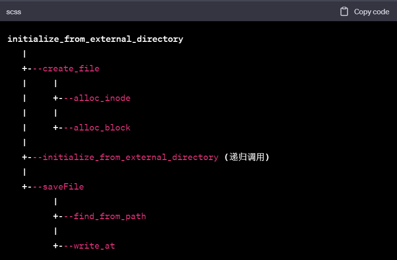

# TJ_FileSystem 
2023 同济操作系统课设

运行环境：Linux

参考 https://github.com/soryxie/fs_tjos 的实现逻辑

实现多用户二级文件管理系统


### 一、使用说明

```shell
git clone https://github.com/qbdl/2023-OS-FileSystem.git

cd 2023-OS-FileSystem
```


```powershell
make all #编译文件
./init #初始化磁盘空间
./server #server端连上
./client #client端连上
	init
    #可以输入相关命令，例如
    ls
    mkdir new_folder
```


### 二、实现过程(按照commit进行增量迭代)

#### 	1、Init 初始化磁盘

##### **磁盘结构：**


##### **磁盘具体内容：**

**（1）超级块，SuperBlock**。管理整张磁盘的存储资源。是一个尺寸为 1024字节的数据结构。登记有

◼ inode 区长度 s_isize

◼ 数据区长度 s_fsize

◼ 管理空闲数据块的数据结构 s_nfree，s_free 和 这个数据结构的锁 s_flock。

◼ 管理空闲 inode 的数据结构 s_ninode，s_inode 和 这个数据结构的锁 s_ilock。

**（2）inode 区**。尺寸固定，N 个扇区；用来存放 inode。

​	inode 是一个尺寸为 64 字节的数据结构。

​	每个扇区可以存放 8 个 inode，inode 区可容纳 8*N 个 inode。这张磁盘最多可以存放8*N 个文件，含目录文件。

​	该区域，资源分配单位是 inode（64 字节）。新建一个文件或子目录，用掉一个 inode；

​	删除一个文件或子目录，回收一个 inode。

**（3）数据区**。尺寸固定，M 个扇区；用来存放文件数据，含目录文件。

​	该区域，资源分配单位是数据块（一个扇区，512 字节）。新建目录文件，用掉 1 个数据块。write 系统调用向文件写入数据，如果导致文件长度增加，为文件多分配一个数据块。


##### 文件数据存储：

​	文件分为目录文件/非目录文件

- **目录文件的内容：一堆目录项**

  - 目录项主要内容

    ```
    1、Inode编号（也被称为索引节点号或inode number）：每个文件或目录都会有一个唯一的Inode编号，可以通过这个编号找到存储文件元信息（如文件大小、文件权限、文件创建和修改时间等）的Inode。
    
    2、文件名：在目录文件中，每个目录项都会包含文件名，用于在用户进行文件操作（如打开文件、删除文件等）时，根据文件名找到对应的文件。
    
    3、（文件类型)
    ```

  - 具体实现

    ```c++
    public:
        int m_ino;              /* 文件inode号 */
        char m_name[DIRSIZ];    /* 文件名 */
        FileType m_type;        /* 文件类型 */
    ```

    

- **非目录文件(普通文件)的内容：**
  - 文件具体存储的数据


#### 	2、调整文件结构

​		makefile修改，文件位置移动

#### 	3、将文件系统初始化进行拆分，分成client与fs+磁盘文件

​		原有initDir里创建文件树部分=>fs内部实现，且由client指定文件并调用

​		原有init.cpp里初始化文件系统空间大小功能 分出（不属于fs/client)

​		用户注册与登录验证


- ##### 具体commit1:将initDir的功能整合入fs中

  - 效果同之前

- **具体commit2:用户登录注册的简单实现，分离client与fs**

  - 增加client作为用户与fs的中介：为每个用户开启一个fs

  - 并由用户(client)指定文件并调用创建文件树部分
    - 三个区块(superblock,inode,data由全局变为成员变量，并在初始与析构时处理)
      - 暂时将数据块全部读取进内存以及写回

  - 效果：


#### 4、整合文件的创建与修改

##### 功能：

​	文件的创建与修改，查找（inode层面）

##### 接口：

- create_file
- delete_file
- find_file

##### 需要：

​	分配给文件的磁盘存储资源 1 个 inode + 用来存放文件数据（逻辑块）的扇区 + 一个目录项


##### create_file实现：在当前目录下创建一个新的文件或者目录

​	get_entry(),push_back_block(),alloc_inode(), init_as_dir(),

- 首先检查文件是否已经存在，如果已经存在，就返回错误信息。
- 检查当前的目录项是否已满，如果已满，需要分配一个新的数据块用来存放目录项。
- 分配一个新的inode用来存放新创建的文件或者目录的信息。
- 如果创建的是一个目录，需要初始化这个目录，即在目录中创建"."和".."两个特殊的目录项。
- 在目录数据块中添加一个新的目录项，包含文件名和对应的inode编号等信息。
  最后更新目录的大小和修改时间。


- inode的分配（alloc_inode)
  - block的分配(alloc_block)
    - block的读(read_block)
    - block的写(write_block)





##### initialize_filetree_from_externalFile修改


##### write_at函数实现：

这个函数用于在文件的特定偏移量（offset）处写入数据（从buf中获取）。

- 如果偏移量加上写入数据的大小（size）大于当前文件大小（d_size），则调用resize()函数来扩大文件。

- 检查偏移量和写入数据的大小是否大于当前文件大小。如果是，调用resize()函数来扩大文件。
- 初始化已写入的数据大小为0（written_size）。
- 在循环中，按照块大小（BLOCK_SIZE）进行数据的写入。在每一次循环中：
  - 计算在inode中的块编号（no）和在块内的偏移量（block_offset）。
  - 获取块编号对应的块（blkno）。
  - 如果获取块失败（blkno < 0），返回已经写入的数据大小。
  - 计算在这个块中可以写入的数据大小（block_write_size），并从buf中获取这部分数据。
  - 将这部分数据写入到块中的相应位置，并更新已写入的数据大小和位置。
- 在循环结束后，如果偏移量和已写入的数据大小大于当前文件大小，更新文件大小（d_size）。
- 最后，返回已写入的数据大小。


效果：


#### 5、支持ls


#### 6、缓存BlockCache与管理

外界所有获取块都使用BlockCache统一接口


#### 7、支持用户输入更多指令

mv, cp, mkdir 等


#### 8、支持多用户

login.cpp=>server.cpp

增加tcp通信


### 补充：

#### 	Makefile:

```makefile
#编译器和编译选项
CC = g++
CFLAGS = -c -std=c++11

#生成文件
TARGET = main

#源文件和对象文件
SRCS = main.cpp
OBJS = $(SRCS:.cpp=.o)

#依赖文件
DEPS=$(wildcard include/*.h)#wildcard允许*表示通配符

# 声明了伪目标all和clean，避免因文件名与目标同名而导致的错误
.PHONY: all clean

#默认目标
all: $(TARGET)
	rm -f $(OBJS)
#命令前加 @ 可以使该命令静默执行（即不输出命令，但执行命令）

#链接目标文件生成目标程序
$(TARGET): $(OBJS)
	$(CC) $(OBJS) -o $(TARGET)

#编译源文件生成目标文件
%.o: %.cpp
	$(CC) $(CFLAGS) $< -o $@

#清除目标
clean:
	rm -f $(OBJS) $(TARGET)

```

​	**Makefile 的工作流程**[^1 ]如下：

- 当你在命令行中输入 make 并按下回车，make 命令默认会寻找名为 all 的目标并尝试生成它。在这个例子中，all 目标依赖于 $(TARGET)，也就是 main。所以 make 命令就会去生成 main。


- 根据定义，main 目标依赖于 $(OBJS)，也就是 main.o。所以 make 命令就会去生成 main.o。


- 根据定义，%.o 目标依赖于同名的 %.cpp 文件。在这个例子中，main.o 目标依赖于 main.cpp。所以 make 命令就会执行 $(CC) $(CFLAGS) $< -o $@，也就是 g++ -c -std=c++11 main.cpp -o main.o，将 main.cpp 编译成 main.o。


- 有了 main.o 之后，make 命令就会执行 $(CC) $(OBJS) -o $(TARGET)，也就是 g++ main.o -o main，将 main.o 链接成可执行的二进制文件 main。


- 最后，all 目标的命令 rm -f $(OBJS) 会执行，删除 main.o 文件。


​	注意，这个 Makefile 是在没有头文件依赖的情况下编写的。如果你的项目中有头文件，你需要将其加入到 %.o 目标的依赖中，并且在生成 %.o 文件的命令中加入-I参数指定头文件的路径。这个路径可以是相对路径，也可以是绝对路径。


[^1]: 路径不要写错 : 当你在命令行中运行一个程序时，你当前的工作目录（working directory）就是该程序的运行目录。这意味着，如果你的程序中使用了相对路径，那么这个路径将是相对于该运行目录的。  由于使用的是makefile并在根目录命令行执行，所以当前工作目录始终为该目录(以此来相对路径搜索)


#### 管理关系：

​	通过各个文件的目录项（各个子文件）=>目录项对应的子文件inode号=>对应子文件的inode=>对应子文件具体信息
